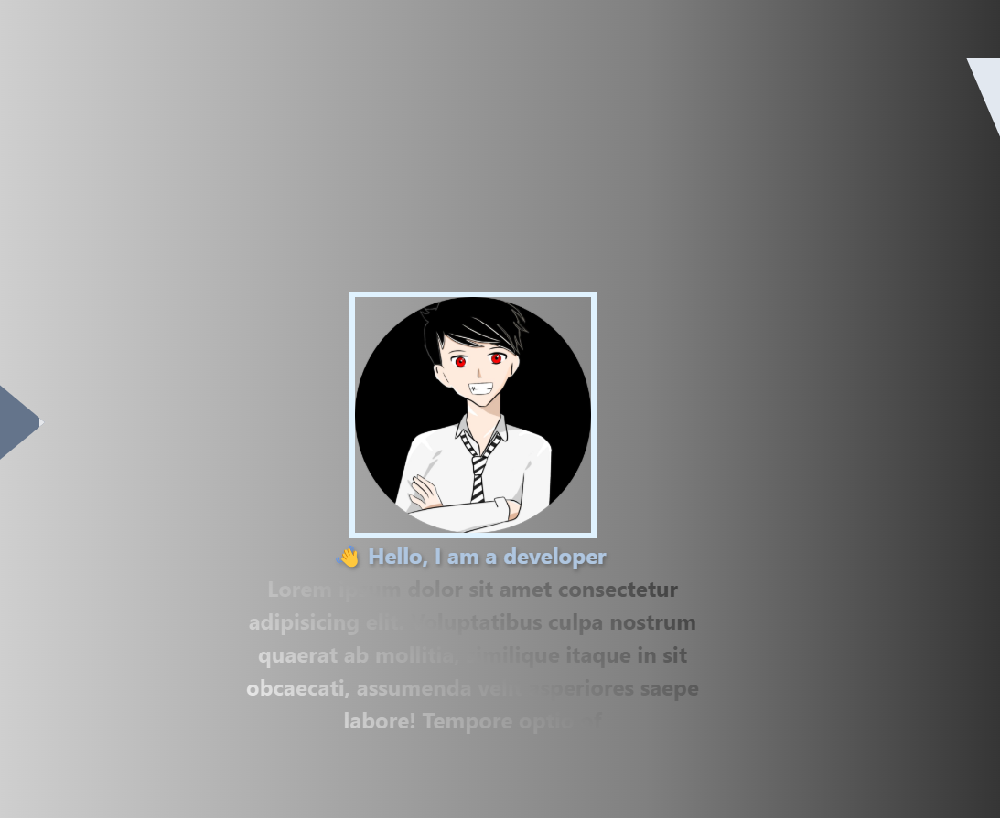

# Hello, I'm dar 👋

### screenshoot

---

## About Me 🧑‍💻

- 🌱 I’m currently learning **JavaScript | TypeScript**, **Python**,**Golang** and **Rust**.
- 👯 I’m looking to collaborate on **open-source projects**.
- 💬 Ask me about **web development**, **backend technologies**, or anything related to coding!
- 📫 How to reach me: [Email](mailto:akunzero975@gmail.com) | [LinkedIn](https://www.linkedin.com/in/kosong)
- 😄 Pronouns: He/Him
- ⚡ Fun fact: I love exploring new technologies and building side projects in my free time!

## 🚀 Technology Used

| Teknologi                        | Ikon    |
| -------------------------------- | ------- |
| **React**                        | ⚛️ `⚛️` |
| **Tailwind CSS**                 | 🎨 `🎨` |
| **react-dom (18.3.1)**           | 🌐 `🌐` |
| **react-icons (5.4.0)**          | 🖼️ `🖼️` |
| **react-scroll (1.9.0)**         | 🔄 `🔄` |
| **react-type-animation (3.2.0)** | ✍️ `✍️` |
| **animejs**                      | 🎞️ `🎞️` |

---

## GitHub Stats 📊

---

## Let's Connect! 🌐

- [GitHub](https://github.com/bgdar)
- [LinkedIn](https://www.linkedin.com/in/kosong)
- [Email](mailto:akunZero975@gmail.com)

---

### Keterangan

`components` = folder utama yang berisi setiap **line page** yang tapil
daftar subCompent pendukung :

1. `bannerCmpnt` : berisi file component untuk bannner line page
2. `codeCmpnt` : berisi file component untuk code line page
3. `personalCmpnt` : berisi file component untuk personal page
4.

---

⭐️ Made with ❤️ by [Muhammad Nadhar](https://github.com/bgdar)
